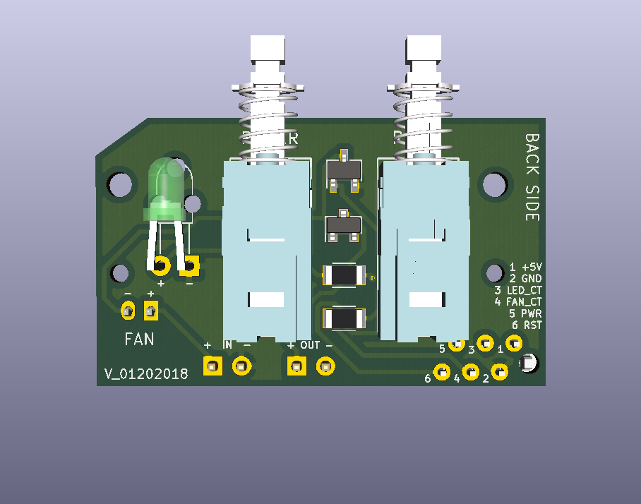
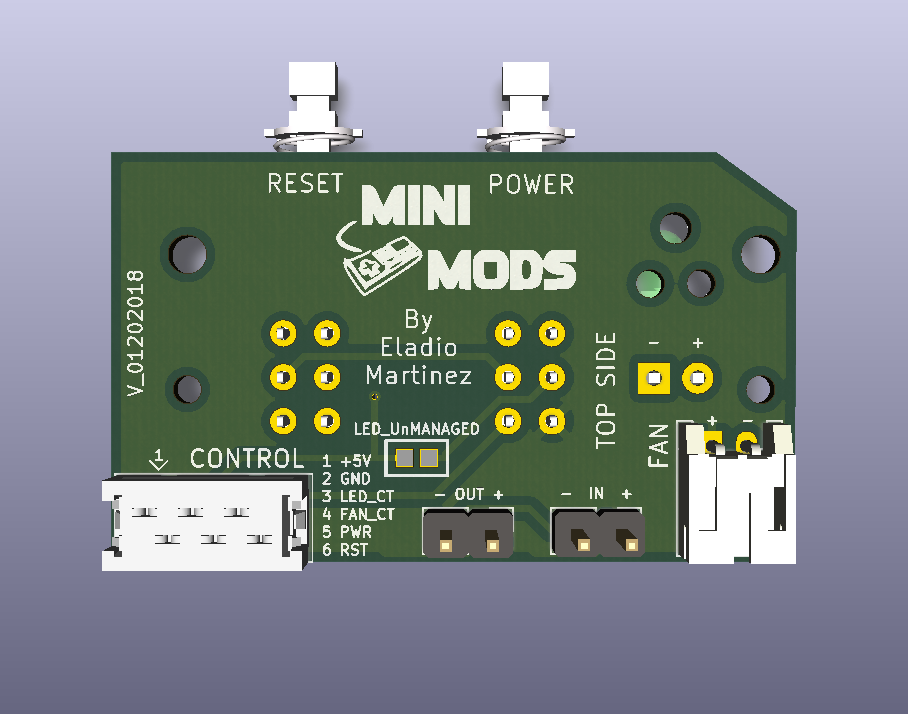
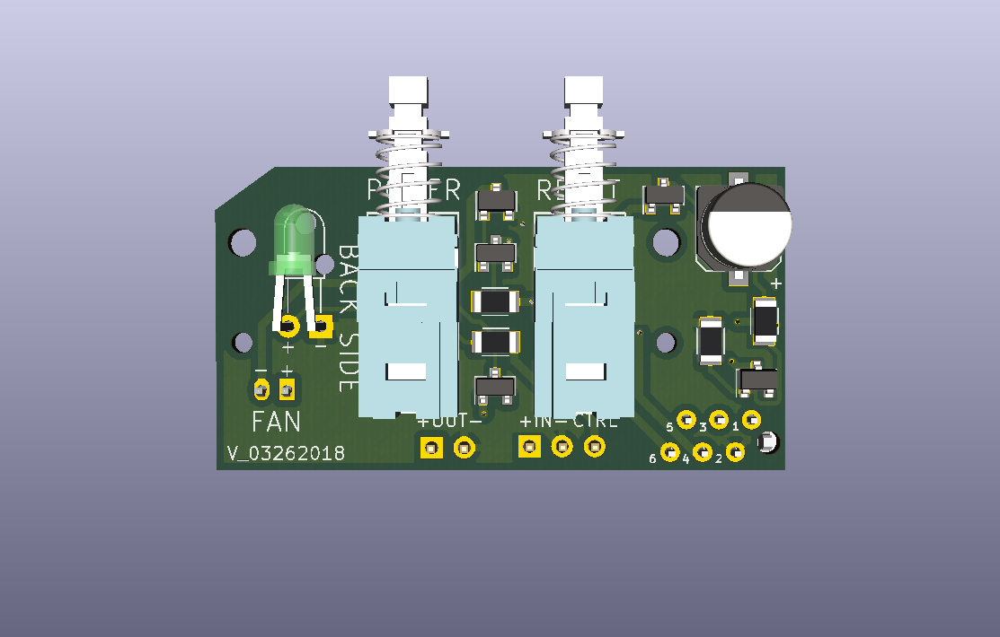
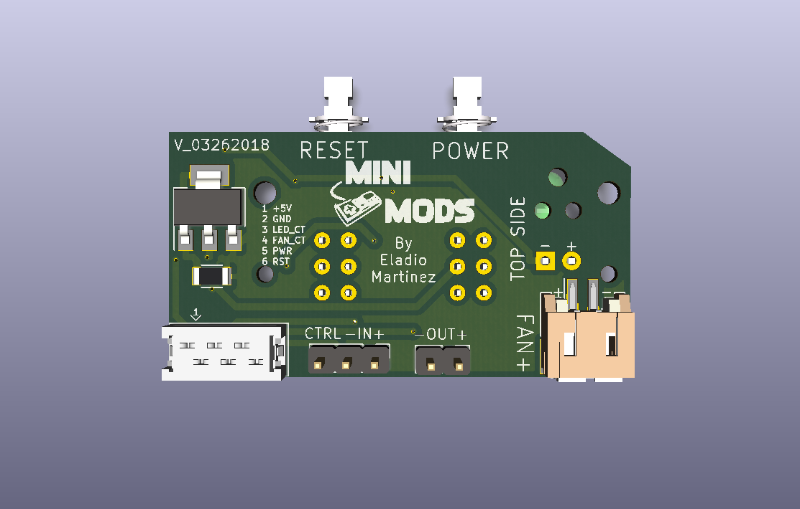
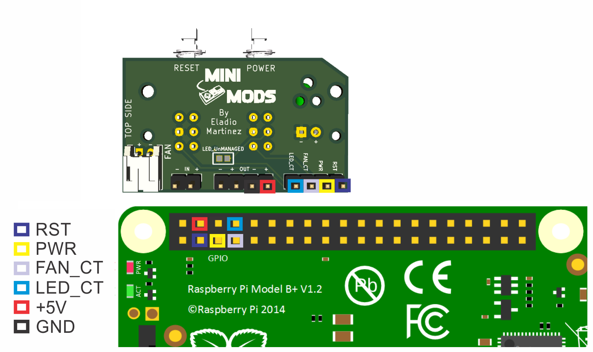

Retroflag NESPi Front Panel Control Board
===============================
This is an enhancement board for the RetroFlag NESPi case, this PCB add missing functionality to the system.


License
-------
<div align="center"><a rel="license" href="https://creativecommons.org/licenses/by-nc-sa/4.0/"></a><br /></div>

This project is licensed under the Attribution-NonCommercial-ShareAlike CC BY-NC-SA 4.0 license. The full legal text of the license may be found in the LICENSE.txt file in this repository. For more information about this license, please visit 
the Creative Commons Foundation (https://creativecommons.org/licenses/by-nc-sa/4.0/).

Features
--------

* Soft-shutdown Pi from power switch

* Disconnect the power from the Raspberry Pi after each shutdown (advance only)

* Reboot Pi from reset switch

* Easy Temperature Control

* 2 wire fan control

* Gracefully finish EmulationStation, letting it save all metadata, in every system shutdown. 

* Fully compatible with Raspbian-RetroPie Pre-made images

* One-line script installation

* You can buy the latest version of this board fully assembled from [http://mini-mods.com](https://mini-mods.com/product/retroflag-control-and-power-boards/)

----------

NESPi Control Board
--------

Bottom Side:


Top Side


----------

NESPi Advance Control Board
--------

Bottom Side:


Top Side


----------

Prerequisites
---------------------

1. RetroPie

      To install Retropie you may download the image for [Raspberry Pi 3](https://github.com/RetroPie/RetroPie-Setup/releases/download/4.2/retropie-4.2-rpi2_rpi3.img.gz "RetroPie for version RPi 2/3") and follow installation instruction at the [retropie website](https://retropie.org.uk/docs/First-Installation/#installation "RetroPie installation instructions").

2. Internet connection

      Internet access via Ethernet or to set up your internet via WiFi, you can follow the instructions [here](https://retropie.org.uk/docs/Wifi/ "RetroPie WiFi Setup").

3. Keyboard and screen, or any computer/laptop (via SSH)

      To access your Pi via SSH, you can also follow this instructions [here](https://retropie.org.uk/docs/SSH/ "Raspberry Pi SSH Setup").


Hardware Installation
---------------------
It's very important to follow the right pin configuration to prevent damage to your Pi.

  * `RST Pin` - Connect to GPIO 2 (RPI pin 3)
  * `PWR Pin` - Connect to GPIO 3 (RPI pin 5)
  * `FAN_CT Pin` - Connect to GPIO 4 (RPI pin 7)
  * `LED_CT` - Connect to GPIO 14 (RPI pin 8) 
  * `OUT + Pin` - Connect to 5V (RPI pin 4)
  * `OUT - Pin` - Connect to GND (RPI pin 6)
  * `- IN + Pin` - Source 5v
  


`Note: LED_CT pin is only available on PCB V_12062017 and up.`

Software Installation
---------------------

**NOTE**: This assumes that you have already connected the jumper wires to the correct PINS and ports;
If you haven't, see the [Hardware Installation](#hardware-installation) section.

This instructions are a *step-by-step guide* to install necessary software for your **Retroflag NESPi Front Panel Control Board**.
You can setup this via SSH or using the command line interface in your RetroPie. To enter the command line interface of RetroPie, *PRESS* ***F4*** just after booting up.

----------
**NESPi Control Board**

Open your terminal and type the one-line installation command below:
```bash
$ wget -O - "https://github.com/mafe72/Retroflag-NESPi-Front-Panel-Control-Board/raw/master/install.sh" | sudo bash
```

----------
**NESPi Advance Control Board**

Open your terminal and type the one-line installation command below:
```bash
$ wget -O - "https://github.com/mafe72/Retroflag-NESPi-Front-Panel-Control-Board/raw/master/install-adv.sh" | sudo bash
```

----------
The script will automatically install pertinent files and configure your Raspberry Pi to enable **Retroflag NESPi Front Panel Control Board.**
Installation will automatically reboot once all processes are completed.

After rebooting, your **Retroflag NESPi Front Panel Control Board** is now fully functional.

Software Uninstall
---------------------

This instructions are a *step-by-step guide* to uninstall the software for the **Retroflag NESPi Front Panel Control Board**.
You can setup this via SSH or using the command line interface in your RetroPie. To enter the command line interface of RetroPie, *PRESS* ***F4*** just after booting up.

----------

Open your terminal and type the one-line installation command below:
```bash
$ wget -O - "https://github.com/mafe72/Retroflag-NESPi-Front-Panel-Control-Board/raw/master/uninstall.sh" | sudo bash
```

The script will automatically uninstall all configuration files from your Raspberry Pi to disable the **Retroflag NESPi Front Panel Control Board.**
The uninstall script will automatically reboot once all processes are completed.

After rebooting, your **Retroflag NESPi Front Panel Control Board** will be fully deactivated.

----------
	
Basic Usage
-----------

* POWER ON
			
		While powered off
			Press (LATCH) POWER button
			LED will turn ON
			Wait for Raspberry Pi to boot		
* POWER OFF
		
		While powered on
			Press (Unlatch) POWER button
			LED will turn OFF
			Wait for Raspberry Pi to shutdown			
* RESET

		While playing a game
			Press RESET button to reboot current game
			No change on LED status
	
* RESET
	
		While playing a game
			Hold RESET button for 3 seconds to quit game
			LED will BLINK
